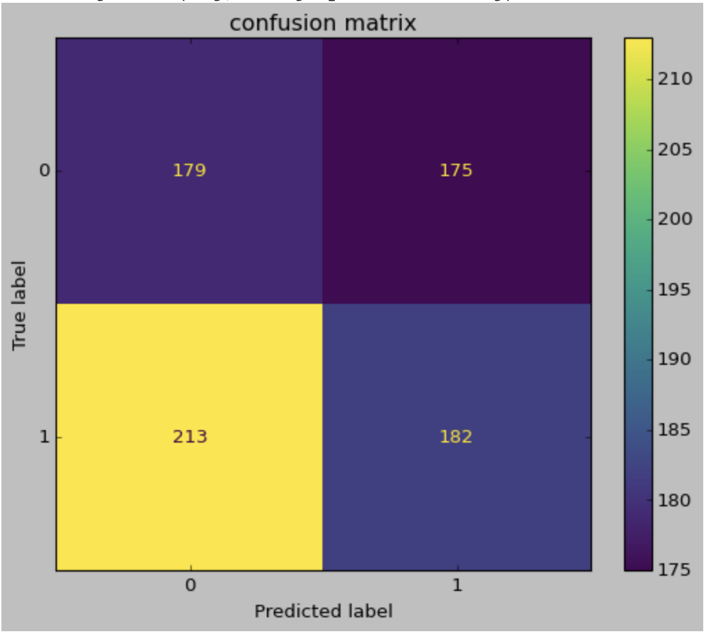
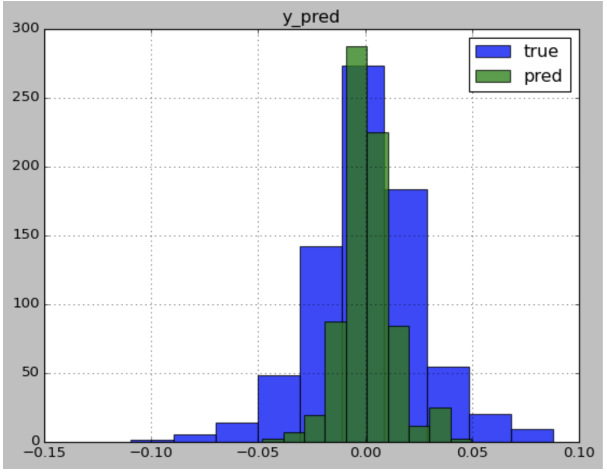

# Machine Learning and Portfolio Optimization in the US Stock Market
## Project information
- **Author**: Jiayi Wang, Applied Mathematics, Class of 2024, Duke Kunshan University
- **Instructor**: Prof. Luyao Zhang, Duke Kunshan University
- **Disclaimer**: Submissions to the Problem Set 2 for STATS201 Introduction to Machine Learning for Social Science, 2022 Autumn Term (Seven Week - Second) instructed by Prof. Luyao Zhang at Duke Kunshan University.
- **Acknowledgments**: I am deeply indebted to my professor Luyao Zhang for her invaluable patience and feedback. I could not started my journey without her instructions and help. Additionally, this endeavor would not have been possible without Yahoo Finance. I am also grateful to my classmates, especially for Josh's suggestions on my poster. Lastly, I would be remiss in not mentioning my family, especially my parents.
- **Project Summary**: 
AI has already been widely used in deciding investments. However, not many previous studies have considered the transaction cost in the US stock market, which cannot verify its earning ability in the real world. We will find out which combination of the machine learning method and portfolio optimization model will construct a portfolio that has the highest net profit. All the stock data used in this project will come from Yahoo Finance. We aim to find the best machine learning method and optimization model for arbitrage by comparing the performance of different combinations. The project will contribute to the application of machine learning methods in investment, and tell which algorithm can construct a better portfolio based on the prediction results. The study considers trade execution, taking transaction cost into account, and thus it can provide a direction for the improvement of the algorithms in a real-world implementation.

## Table of Contents
| Contents  | URL |
| ------------- | ------------- |
| Data  | https://github.com/Rising-Stars-by-Sunshine/Jiayi-Wang-FinalProject#data |
| Code  | https://github.com/Rising-Stars-by-Sunshine/Jiayi-Wang-FinalProject#code  |
| Spotlight  | https://github.com/Rising-Stars-by-Sunshine/Jiayi-Wang-FinalProject#Spotlight  |
| more about the author  | https://github.com/Rising-Stars-by-Sunshine/Jiayi-Wang-FinalProject#more-about-the-author |
| references  | https://github.com/Rising-Stars-by-Sunshine/Jiayi-Wang-FinalProject#references  |

## Data
| Contents  | URL |
| ------------- | ------------- |
| Data Source | [Yahoo Finance](https://finance.yahoo.com) |
| Queried Data  |  https://github.com/Rising-Stars-by-Sunshine/Jiayi-Wang-FinalProject/tree/main/data/Queried%20data |
| Processed Data  |  https://github.com/Rising-Stars-by-Sunshine/Jiayi-Wang-FinalProject/tree/main/data/Processed_Data |

## Code
| Contents  | URL |
| ------------- | ------------- |
| Process Data  |  https://github.com/Rising-Stars-by-Sunshine/Jiayi-Wang-FinalProject/blob/main/code/Process_Code_.ipynb |
| Analyze Data  |  https://github.com/Rising-Stars-by-Sunshine/Jiayi-Wang-FinalProject/blob/main/code/Jiayi_Wang_Analyze_Data_Machine_Learning_for_Predicting_ROI.ipynb |

## Spotlight
- **Posters**:

Figure No.1. Project Poster

**Figure No.1. Project poster, created by [Canva](https://www.canva.com)**

- **Figures**:

Figure No.2. The Confusion Matrix for Random Forest Classifier

**Figure No.2. source: [Yahoo Finance, Alphabet Inc.](https://finance.yahoo.com/quote/GOOGL/history?p=GOOGL), created by [scikit-learn](https://scikit-learn.org/stable/modules/generated/sklearn.ensemble.RandomForestClassifier.html)**

Figure No.2 is the confusion matrix of [Ridge Classification](https://scikit-learn.org/stable/modules/linear_model.html#ridge-regression-and-classification) algorithm for GOOGL's return of investment (ROI) prediction using historical ROI data. The confusion matrix evaluates the performance of the classification algorithm. In this matrix, the X-axis is the predicted label and the Y-axis is the true label, in which 0 implies negative ROI while 1 indicates the ROI is nonnegative. From the left to the right, from the top to the bottom are TP, FP, FN, and TN respectively. In the model, the accuracy is (TP + TN)/(TP + TN + FP + FN) = 361/ 749= 0.48, the recall is TP/(TP + FN) = 182/361 = 0.50, and the precision is TP/(TP + FP) = 182/357 = 0.51 

Figure No.3. Histogram of Prediction Value y under Random Forest Regression

**Figure No.3. source: [Yahoo Finance, Alphabet Inc.](https://finance.yahoo.com/quote/GOOGL/history?p=GOOGL), created by [scikit-learn](https://scikit-learn.org/stable/modules/generated/sklearn.ensemble.RandomForestClassifier.html)**

Figure No.3 is the histogram of prediction value and true value using the algorithm Random Forest Regression. We are using the historical return of investment (ROI) data of GOOGL to predict the GOOGL ROI. The x-axis represents the ROI and the y-axis represents the number of data under each ROI. The more area the true value and the prediction value duplicates, the more accurate the prediction is. Under this algorithm, some area of true and the prediction duplicates together while the area is not large, showing that the predictive result is not very close to the true value. Meanwhile, the r2 score is -0.21, which is the closer to 1, the two variables are more related, showing the two values are not strongly correlated. 

## More about the Author
- Headshot: 

)
- self-introduction:
My name is Jiayi Wang. I am a junior at Duke Kunshan University. I major in Applied mathematics with track in Economics and Environment. I am interested in Computational Science, Blochchain, Chemistry and Finance.
- Final reflections 

## References

### Data Source
| Source  | URL |
| ------------- | ------------- |
| Yahoo Finance | https://finance.yahoo.com |
### Code Source
[stats201-tutorial-prediction/code](https://github.com/Rising-Stars-by-Sunshine/stats201-tutorial-prediction/tree/main/code)
### Articles
[Optimal Inattention to the Stock Market with Information Costs and Transactions Costs](https://doi.org/10.3982/ecta7624)

[Machine Learning and Portfolio Optimization](https://doi.org/10.3982/ecta7624)

[A Machine Learning Platform for Stock Investment Recommendation Systems](https://doi.org/10.1007/978-3-030-53036-5_33)

[Bridging Level-K to Nash Equilibrium](https://doi.org/10.1162/rest_a_00990)

[Portfolio Optimization with Return Prediction Using Deep Learning and Machine Learning](https://doi.org/10.1016/j.eswa.2020.113973)

[Portfolio Selection: A Statistical Learning Approach](https://doi.org/10.1145/3533271.3561707)
### Literature
Abel, Andrew B., Janice C. Eberly, and Stavros Panageas. 2013. “Optimal Inattention to the Stock Market with Information Costs and Transactions Costs.” *Econometrica* 81 (4): 1455–81. https://doi.org/10.3982/ecta7624.

Ban, Gah-Yi, Noureddine El Karoui, and Andrew E. B. Lim. 2018. “Machine Learning and Portfolio Optimization.” *Management Science* 64 (3): 1136–54. https://doi.org/10.1287/mnsc.2016.2644.

Hernández-Nieves, Elena, Álvaro Bartolomé del Canto, Pablo Chamoso-Santos, Fernando de la Prieta-Pintado, and Juan M. Corchado-Rodríguez. 2020. “A Machine Learning Platform for Stock Investment Recommendation Systems.” *Advances in Intelligent Systems and Computing* 1237 (August): 303–13. https://doi.org/10.1007/978-3-030-53036-5_33.

Levin, Dan, and Luyao Zhang. 2020. “Bridging Level-K to Nash Equilibrium.” *The Review of Economics and Statistics* 104 (6): 1329–40. https://doi.org/10.1162/rest_a_00990.

Ma, Yilin, Ruizhu Han, and Weizhong Wang. 2021. “Portfolio Optimization with Return Prediction Using Deep Learning and Machine Learning.” *Expert Systems with Applications* 165 (March): 113973. https://doi.org/10.1016/j.eswa.2020.113973.

Peng, Yiming, and Vadim Linetsky. 2022. “Portfolio Selection: A Statistical Learning Approach.” *ICAIF ’22: 3rd ACM International Conference on AI in Finance*, October, 257-263. https://doi.org/10.1145/3533271.3561707.

Zhang, L. (Sunshine). (2022). Machine Learning for Predictions. Machine Learning for Social Science. Retrieved from https://ms.pubpub.org/pub/ml-prediction

Zhang, L. (Sunshine). (2022). Venues for Computer Security and Beyond. Machine Learning for Social Science. Retrieved from https://ms.pubpub.org/pub/security

Zhang, L. (Sunshine). (2022). Venues for Machine Learning&nbsp; Machine Learning for Social Science. Retrieved from https://ms.pubpub.org/pub/ml

Zhang, L. (Sunshine). (2022). Computing Platforms: Set up the Workspace for Machine Learning Projects. Machine Learning for Social Science. Retrieved from https://ms.pubpub.org/pub/computing

Zhang, L. (Sunshine). (2022). Resources for Blockchain Network Studies. Machine Learning for Social Science. Retrieved from https://ms.pubpub.org/pub/network

